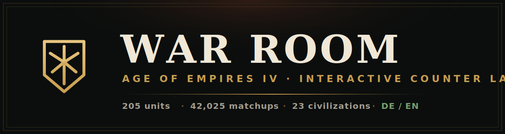
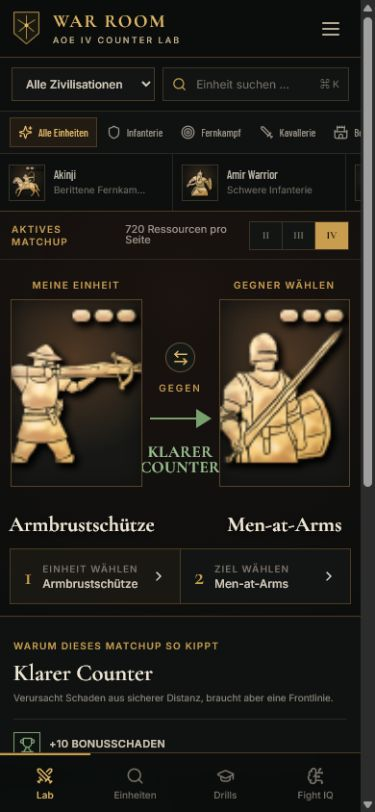

<div align="center">



<h1>WAR ROOM</h1>

<p><b>An interactive counter lab for Age of Empires IV.</b><br />
Learn which unit beats which — with an explainable matchup model, decision drills, and six practical combat rules.</p>

<p>
  <a href="https://aoe4.hazii.org"></a>
</p>

<p>
  <a href="https://github.com/haZiinstinct/aoe4-war-room/actions/workflows/ci.yml"></a>
  
  
  
  
</p>

<sub><a href="#-four-ways-to-get-better">Modes</a> · <a href="#-how-the-model-works">How it works</a> · <a href="#-use-it">Use it</a> · <a href="#-tech--development">Tech</a> · <a href="#-data--sources">Data</a></sub>

</div>

---

WAR ROOM turns raw Age of Empires IV unit data into something you can actually
**learn from**. Instead of a static counter chart, it explains _why_ a matchup
tips the way it does — bonus damage, range, cost efficiency, terrain and micro —
and lets you change the fight and watch the answer change with it.

It runs as a **single HTML file**: open it, host it anywhere, or use the live
demo. No install, no account, no tracking.

## ✨ Highlights

- 🗡️ **205 units** across **23 civilizations**, **42,025** directed unit-vs-unit matchups
- 🧠 **Explainable model** — every verdict comes with its reasoning and a confidence score, close fights are flagged as _skill matchups_
- 🎚️ **Change the fight** — resources vs. 1-on-1, age, upgrades, terrain and micro; watch tight matchups flip
- 🌍 **German & English** — full UI toggle, your choice is remembered
- 🎯 **Real data** — pulled from [aoe4world/data](https://github.com/aoe4world/data), no made-up numbers
- 📦 **Standalone** — one self-contained file, works offline (images/fonts load online), deploy on any static host
- ♿ **Accessible & responsive** — keyboard-friendly, focus-managed, mobile-ready

## 🎮 Four ways to get better

|                      |                                                                                                                                                                                                                |
| -------------------- | -------------------------------------------------------------------------------------------------------------------------------------------------------------------------------------------------------------- |
| ⚔️ **Counter Lab**   | Pick your unit and the enemy. Get a clear verdict (from _clear counter_ to _hard loss_), a model-confidence %, and the reasons behind it. Ranked counter suggestions update as you tweak the combat variables. |
| 🔎 **Unit Explorer** | Browse and filter every unit. Each dossier shows stats, weapons, _strong against / weak against_ lists and concrete usage tips.                                                                                |
| ⏱️ **Drills**        | The enemy is massing something — pick the best affordable answer in 12 seconds. Your streak and progress are saved locally.                                                                                    |
| 🧭 **Fight IQ**      | Six practical combat rules (scout production, compare resources, control the contact, play the space, target by value, switch before you must) plus a 10-second pre-fight checklist.                           |

## 🖼️ Screenshots

<div align="center">
  
  <br /><br />
  
</div>

> The app itself is bilingual — switch between 🇩🇪 Deutsch and 🇬🇧 English with the
> toggle in the top-right corner.

## 🧠 How the model works

The matchup score is a **learning model, not a frame-perfect combat simulator.**
For each side it combines:

- **class & bonus damage** against the opponent's classes,
- **hit points, armour, attack speed and range**,
- a **cost comparison** (equal resources) or a straight **1-on-1**,
- and modifiers for **terrain, micro level and relative upgrade advantage**.

The two sides are compared into a ratio, mapped to a verdict, and paired with a
**model-confidence** value so you can tell a clear result from a coin-flip.

**Deliberate limits** — civilization bonuses, activated abilities, landmark
effects, formation depth, real pathfinding and patch special cases can flip a
result. That's exactly why close matchups are marked as _skill matchups_ rather
than pretending to be certain. All tuning constants are named and documented in
[`src/lib/matchup.config.js`](src/lib/matchup.config.js).

## 🚀 Use it

- **▶ Live demo:** **<https://aoe4.hazii.org>**
- **📥 Download:** grab `war-room.html` from the [latest release](https://github.com/haZiinstinct/aoe4-war-room/releases/latest) and open it by double-clicking.
- **🌐 Self-host:** it's a single static file — drop it on any webspace, Netlify Drop, GitHub Pages, etc. See [`deploy/`](deploy) for a ready-made CSP and step-by-step notes.

## 🛠️ Tech & development

React 19 + Vite 6, bundled into one file via `vite-plugin-singlefile`. Quality is
guarded by ESLint, Prettier, JSDoc type-checking, a Vitest suite and GitHub
Actions CI.

```bash
npm install
npm run dev        # local dev server on http://127.0.0.1:5173
npm run build      # production build → outputs/index.html (standalone)
npm run audit      # lint · typecheck · test · build · standalone check
```

Updating the game data:

```bash
git clone --depth 1 https://github.com/aoe4world/data.git work/aoe4world-data
npm run generate:data
```

The generator bakes data-driven combat flags into `src/data/units.generated.js`
and **warns** when listed special units disappear or new class tokens appear, so
balance patches surface instead of silently breaking the logic.

## 📊 Data & sources

- [Official civilization directory](https://www.ageofempires.com/civilizations/)
- [Official introduction to the counter principle](https://www.ageofempires.com/news/age-of-empires-iv-tips-to-help-you-get-started/)
- [aoe4world/data](https://github.com/aoe4world/data) — unit values extracted from the game files
- [aoe4world Explorer](https://aoe4world.com/explorer)

The exact upstream commit is recorded in the header of
`src/data/units.generated.js`.

## ⚖️ Disclaimer

Age of Empires IV and related marks are property of their respective owners. This
is an **independent, non-commercial fan learning project** and is **not affiliated
with Microsoft or Relic Entertainment**. Not currently released under an
open-source license.

<div align="center"><sub>Built by <a href="https://hazii.org">haZii</a> · <code>// webdesign: haZii.org</code></sub></div>
