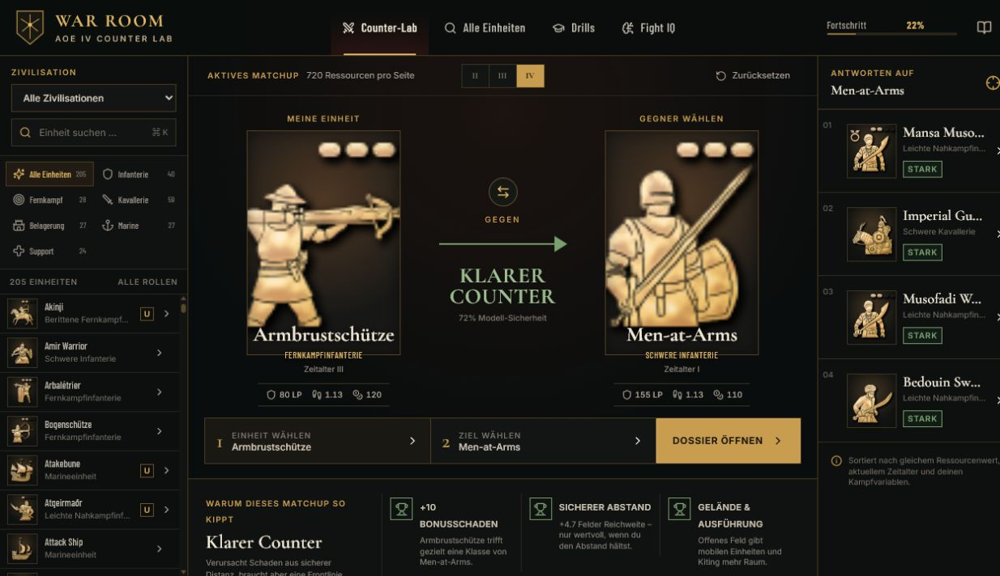

# WAR ROOM — AoE IV Counter Lab

Interaktive, deutschsprachige Lern-App für Age of Empires IV. Sie kombiniert
einen vollständigen Einheiten-Browser mit einem erklärbaren Matchup-Modell,
Entscheidungs-Drills und sechs praktischen Kampfregeln.



## Enthalten

- 205 militärisch klassifizierte Einträge aus 23 Zivilisationen
- 42.025 gerichtete Einheit-gegen-Einheit-Paarungen
- getrennte Land- und Marinevergleiche
- Kosten- oder 1:1-Vergleich
- Variablen für Upgrades, Gelände und Micro
- Such- und Filteroberfläche für Standard-, Spezial- und Unterstützungseinheiten
- interaktive Counter-Drills mit lokal gespeichertem Fortschritt
- responsive Desktop- und Mobile-Oberfläche

## Sofort benutzen oder hochladen

Die fertige Datei liegt unter `outputs/index.html`.

- Per Doppelklick direkt im Browser öffnen.
- Als einzelne `index.html` auf einen Webspace, Netlify Drop, GitHub Pages
  oder einen beliebigen statischen Hoster hochladen.
- An andere Personen schicken; es werden keine zusätzlichen JavaScript- oder
  CSS-Dateien benötigt.

Die Einheitengrafiken und Webfonts werden online geladen. Die Oberfläche,
Einheitendaten und komplette Counter-Logik stecken direkt in der HTML-Datei.

## Entwicklung lokal starten

```powershell
npm.cmd install
npm.cmd run dev
```

Danach `http://127.0.0.1:5173/` öffnen.

Produktions-Build und neue Standalone-Datei erzeugen:

```powershell
npm.cmd run build
```

Der Build prüft automatisch, dass keine lokalen `/assets`-Abhängigkeiten in
der fertigen Datei verbleiben.

## Qualitätssicherung

Die Codebasis ist mit ESLint, Prettier, JSDoc-Typprüfung (`tsc --checkJs`) und
einer Vitest-Suite abgesichert; eine GitHub-Actions-CI führt dieselben Schritte
bei jedem Push und Pull Request aus.

```powershell
npm.cmd run lint        # ESLint
npm.cmd run format      # Prettier schreiben
npm.cmd run typecheck   # JSDoc-Typen via tsc --checkJs
npm.cmd run test        # Vitest
npm.cmd run audit       # lint + typecheck + test + build + Standalone-Prüfung
```

Der ausführliche Prüfbericht liegt in [AUDIT.md](AUDIT.md).

## Daten aktualisieren

Die generierte Datei `src/data/units.generated.js` basiert auf
[aoe4world/data](https://github.com/aoe4world/data). Für ein Update:

```powershell
git clone --depth 1 https://github.com/aoe4world/data.git work/aoe4world-data
npm.cmd run generate:data
```

Der Generator schreibt den Upstream-Commit (statt eines Build-Datums) in den
Kopf der generierten Datei – das hält Git-Diffs sauber und macht den Datenstand
reproduzierbar. Er validiert außerdem das Upstream-Schema und **warnt sichtbar**,
wenn gelistete Spezialeinheiten (Belagerung, Anti-Infanterie, Formationen) nicht
mehr existieren oder neue Klassen-Tokens auftauchen – so fallen Balance-Patches
auf, statt still die Counter-Logik zu verfälschen. Die Kampf-Flags
(`flags.splash`, `flags.antiInfantryMelee`, `flags.formation`) werden hier
gesetzt und von der Laufzeitlogik nur noch gelesen.

## Methodik

Der Matchup-Score ist ein Lernmodell, kein frame-genauer Simulator. Er
berücksichtigt Klassen- und Bonus-Schaden, Trefferpunkte, Rüstung,
Angriffstempo, Reichweite, Kosten, Gelände, Micro und relativen
Upgrade-Vorteil. Aktive Fähigkeiten, Landmark-Effekte, exakte Formationen und
Patch-Sonderfälle können enge Ergebnisse drehen; solche Paarungen werden als
Skill-Matchup gekennzeichnet.

Quellen:

- [Offizielles Zivilisationsverzeichnis](https://www.ageofempires.com/civilizations/)
- [Offizielle Einführung in das Counter-Prinzip](https://www.ageofempires.com/news/age-of-empires-iv-tips-to-help-you-get-started/)
- [AoE4 World Data](https://github.com/aoe4world/data)
- [AoE4 World Explorer](https://aoe4world.com/explorer)

Datenstand: 30. Juni 2026.

Age of Empires IV und zugehörige Bezeichnungen sind Eigentum ihrer jeweiligen
Rechteinhaber. Dieses unabhängige Lernprojekt ist nicht mit Microsoft verbunden.
